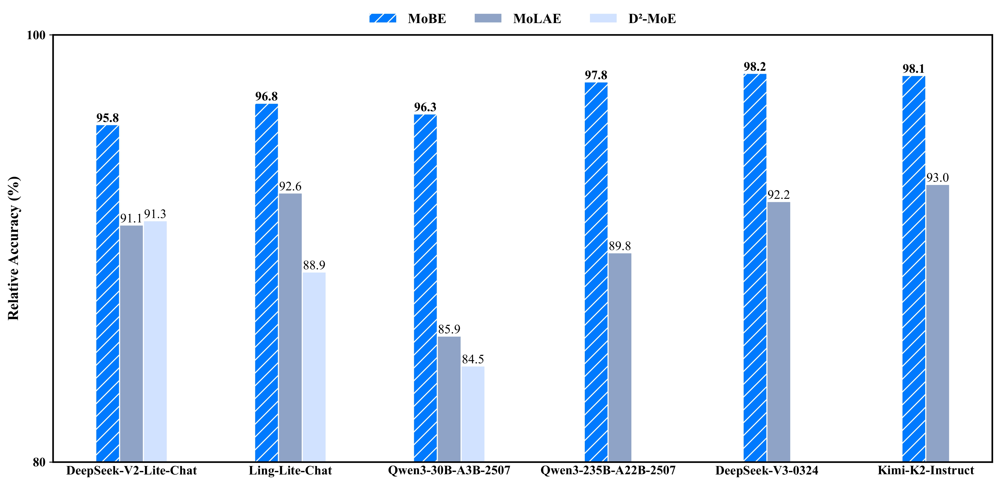

<h1 align="center">
  MoBE: Mixture-of-Basis-Experts for Compressing <br> MoE-based LLMs
</h1>
<div style="text-align:center;">
  <a href="https://arxiv.org/abs/2508.05257">
    
  </a>
</div>

---
## ✅ Feature List
- [x] **Supported multiple MoE models**
  - [x] Ling Family
  - [x] Qwen3MoE Family
  - [x] DeepSeek-V3
  - [x] Kimi-K2-Instruct
- [ ] **Supported SGLang inference (with fused-MoE kernel)**
- [ ] **Supported MoBE mega-kernel (high-performance fused kernel for MoBE)**
> 💡 *Coming soon: Optimized inference kernels for MoBE models to maximize throughput and memory efficiency.*
---

## 📘 Introduction

**MoBE (Mixture-of-Basis-Experts)** is a novel model compression technique designed for MoE LLMs developed by the **AGI Center, Ant Group Research**. It achieves efficient parameter reduction by factorizing each expert's weight matrix as:

$$
\mathbf{W} = \mathbf{A}\mathbf{B}, \quad \text{where} \quad \mathbf{B} = \sum_{i=1}^m \alpha_i B_i
$$

- $\mathbf{A}$: Expert-specific matrix  
- $\mathbf{B}$: Linear combination of **basis matrices** across all experts, weighted by coefficients $\alpha_i$

The factorization is learned by minimizing the **reconstruction error** between the original and compressed weight matrices.

### 🔍 Key Results
MoBE significantly outperforms prior compression methods with minimal accuracy degradation:
- Reduces parameter count by **24%–30%** in leading open-source models
- Incurs only **1%–2% absolute accuracy drop** (≈2% relative)
- Demonstrated on **Qwen3-235B**, **DeepSeek-V3 (671B)**, and **Kimi-K2-Instruct (1T)**


## 📊 Evaluation Results


---

## 🚀 Quickstart

### 🔧 Installation
```
pip install -r requirement.txt
```

---

### 🛠️ Step-by-Step Instructions
Converting an MoE model to MoBE involves two stages:
1. **Train** the MoBE decomposition.
2. **Generate** either a native MoBE model or reconstruct a standard MoE for compatibility.
---
#### 1. Train MoBE Matrices
```
python train.py --index_path /root/DeepSeek-V3-0324/model.safetensors.index.json \
      --base_dir /root/DeepSeek-V3-0324 \
      --save_path /root/MoBE/DeepSeek-V3-0324 \
      --num_hidden_layers 61 \
      --num_matrices 256 \
      --rows_per_matrix 2048 \
      --cols 7168 \
      --num_epochs 10000 \
      --batch_size 32 \
      --num_batches 8 \
      --learning_rate 0.07 \
      --num_B 64 \
      --truncation 2048 \
      --start_layer 3 \
      --end_layer 61 \
      --matrix_type "gate_proj" \
      --activation 'tanh'
```
| Argument | Description |
|--------|-------------|
| `index_path` | Path to `.safetensors.index.json` mapping tensor names to shards |
| `base_dir` | Root directory containing model shards |
| `save_path` | Output directory for trained MoBE matrices |
| `num_hidden_layers` | Total number of transformer layers |
| `num_matrices` | Number of experts in the original MoE model |
| `rows_per_matrix` | Row dimension of the weight matrices (e.g., `up_proj`, `gate_proj`) |
| `cols` | Column dimension of the weight matrices |
| `num_epochs` | Number of optimization steps for reconstruction |
| `batch_size` | Batch size (number of experts sampled per step) |
| `num_batches` | Number of batches processed per epoch. Total experts in one layer = `batch_size × num_batches` |
| `learning_rate` | Learning rate for the optimizer (e.g., Adam) |
| `num_B` | Number of basis matrices used in the MoBE |
| `truncation` | Maximum number of rows retained in each basis matrix |
| `start_layer` | First transformer layer (inclusive) to apply MoBE compression |
| `end_layer` | Last transformer layer (exclusive) to apply compression |
| `matrix_type` | Type of weight matrix to compress (e.g., `"gate_proj"`, `"up_proj"`) |
| `activation` | Activation function used in MoBE (e.g., `"silu"`, `"tanh"`) |

> 💡 **Tip**: Run this step separately for each `matrix_type` (e.g., `gate_proj`, `up_proj`) within the same layer range.

For Kimi-K2-Instruct, we recommend dividing the experts within each transformer layer into two groups and applying MoBE compression separately to each group. 
```
python train_group.py --index_path /root/Kimi-K2-Instruct/model.safetensors.index.json \
      --base_dir /root/Kimi-K2-Instruct \
      --save_path /root/MoBE/Kimi-K2-Instruct \
      --num_hidden_layers 61 \
      --num_matrices 384 \
      --rows_per_matrix 2048 \
      --cols 7168 \
      --num_epochs 15000 \
      --batch_size 32 \
      --num_batches 12 \
      --learning_rate 0.07 \
      --num_B 128 \
      --truncation 2048 \
      --start_layer 1 \
      --end_layer 61 \
      --matrix_type "gate_proj" \
      --num_groups 2 \
      --activation 'silu'
```
| Argument | Description |
|--------|-------------|
| `index_path` | Path to `.safetensors.index.json` mapping tensor names to shards |
| `base_dir` | Root directory containing model shards |
| `save_path` | Output directory for trained MoBE matrices |
| `num_hidden_layers` | Total number of transformer layers |
| `num_matrices` | Number of experts in the original MoE model |
| `rows_per_matrix` | Row dimension of the weight matrices (e.g., `up_proj`, `gate_proj`) |
| `cols` | Column dimension of the weight matrices |
| `num_epochs` | Number of optimization steps for reconstruction |
| `batch_size` | Batch size (number of experts sampled per step) |
| `num_batches` | Number of batches processed per epoch. Total experts in one layer = `batch_size × num_batches` |
| `learning_rate` | Learning rate for the optimizer (e.g., Adam) |
| `num_B` | Number of basis matrices used in the MoBE |
| `truncation` | Maximum number of rows retained in each basis matrix |
| `start_layer` | First transformer layer (inclusive) to apply MoBE compression |
| `end_layer` | Last transformer layer (exclusive) to apply compression |
| `matrix_type` | Type of weight matrix to compress (e.g., `"gate_proj"`, `"up_proj"`) |
| `activation` | Activation function used in MoBE (e.g., `"silu"`, `"tanh"`) |
| `num_groups` | Number of expert groups to split the original MoE experts into before applying MoBE compression separately to each group |

---

#### 2. Generate MoBE or Reconstructed MoE Model

After training, you can:
- Deploy the **native MoBE model** (high compression)
- Reconstruct a **standard MoE model** for compatibility with `vLLM` or `SGLang`

##### 🔹 Option A: Save Native MoBE Model
```
python get_mobe.py --base_model /root/DeepSeek-V3-0324 \
      --mobe_dir /root/MoBE/DeepSeek-V3-0324 \
      --save_dir /root/DeepSeek-V3-0324-MoBE \
      --num_B 64 \
      --num_experts 256 \
      --start_layer 3 \
      --end_layer 61 \
      --dtype bfloat16 \
      --activation 'tanh' 
```
###### Arguments

| Argument | Description |
|--------|-------------|
| `base_model` | Path to the original model directory |
| `mobe_dir` | Directory containing trained MoBE matrices (`A`, `B^i`, `α_i`) |
| `save_dir` | Where to save the final MoBE model |
| `num_B` | Number of basis matrices (must match training) |
| `num_experts` | Number of experts in the original model |
| `start_layer` | First layer to replace with MoBE (inclusive) |
| `end_layer` | Last layer to replace (exclusive) |
| `dtype` | Target data type (`float32`, `bfloat16`, `float16`) |
| `activation` | Activation function used in MoBE (e.g., `"silu"`, `"tanh"`) |
| `grouped_experts` | Whether to group experts within the same layer |

##### 🔹 Option B: Reconstruct Standard MoE Weights

For seamless integration with existing inference engines:
```
python get_hf_model.py --base_model /root/DeepSeek-V3-0324 \
      --mobe_dir /root/MoBE/DeepSeek-V3-0324 \
      --save_dir /root/DeepSeek-V3-0324-MoBE-hf \
      --start_layer 3 \
      --end_layer 61 \
      --num_experts 256 \
      --dtype bfloat16 
```
###### Arguments

| Argument | Description |
|--------|-------------|
| `base_model` | Path to the original model directory |
| `mobe_dir` | Directory containing trained MoBE matrices (`A`, `B^i`, `α_i`) |
| `save_dir` | Output path for reconstructed MoE model |
| `start_layer` | First layer to replace with MoBE (inclusive) |
| `end_layer` | Last layer to replace (exclusive) |
| `num_experts` | Number of experts in the original model |
| `dtype` | Target data type (`float32`, `bfloat16`, `float16`) |
| `grouped_experts` | Whether to group experts within the same layer |

> ✅ The reconstructed model is **fully compatible** with Hugging Face `AutoModelForCausalLM`, `vLLM`, and `SGLang`.

---

## 💡 MoBE Generate Example

```
from transformers import AutoTokenizer
from models.modeling_deepseek_v3_mobe import DeepseekV3MoBEForCausalLM 
from models.modeling_qwen3_mobe import Qwen3MoBEForCausalLM
from models.modeling_kimi_k2_mobe import KimiK2MoBEForCausalLM
import torch

model_name = "/root/DeepSeek-V3-0324-MoBE"
offload_folder = "./offload_dir"

tokenizer = AutoTokenizer.from_pretrained(model_name)
tokenizer.pad_token = tokenizer.eos_token

max_memory = {i: "120GiB" for i in range(8)}  
max_memory["cpu"] = "1200GiB"      

if 'Qwen' in model_name:
    model = Qwen3MoBEForCausalLM.from_pretrained(
    		model_name,
    		device_map="auto",
    		offload_folder=offload_folder,
    		offload_state_dict=True,
    		torch_dtype=torch.bfloat16
        max_memory=max_memory
    )
elif 'DeepSeek' in model_name:
    model = DeepseekV3MoBEForCausalLM.from_pretrained(
    		model_name,
    		device_map="auto",
    		offload_folder=offload_folder,
    		offload_state_dict=True,
    		torch_dtype=torch.bfloat16,
        max_memory=max_memory
    )
else:
		model = KimiK2MoBEForCausalLM.from_pretrained(
    		model_name,
    		device_map="auto",
    		offload_folder=offload_folder,
    		offload_state_dict=True,
    		torch_dtype=torch.bfloat16,
        max_memory=max_memory
    )

input_text = "Artificial intelligence is"
inputs = tokenizer(input_text, return_tensors="pt").to("cuda" if torch.cuda.is_available() else "cpu")

with torch.no_grad():
outputs = model.generate(
		**inputs,
		max_new_tokens=128,
		do_sample=True,
		temperature=0.7,
		pad_token_id=tokenizer.eos_token_id
)

generated_text = tokenizer.decode(outputs[0], skip_special_tokens=True)
print("Generated text:")
print(generated_text)
```
---

## 📚 Citation

If you find MoBE useful in your research or application, please consider citing our work:
```down-bibtex
@misc{chen2025mobemixtureofbasisexpertscompressingmoebased,
      title={MoBE: Mixture-of-Basis-Experts for Compressing MoE-based LLMs}, 
      author={Xiaodong Chen and Mingming Ha and Zhenzhong Lan and Jing Zhang and Jianguo Li},
      year={2025},
      eprint={2508.05257},
      archivePrefix={arXiv},
}
```

## Contact Us
If you are interested to leave a message to either our research team (shiguang.cxd@antgroup.com, lijg.zero@antgroup.com).
